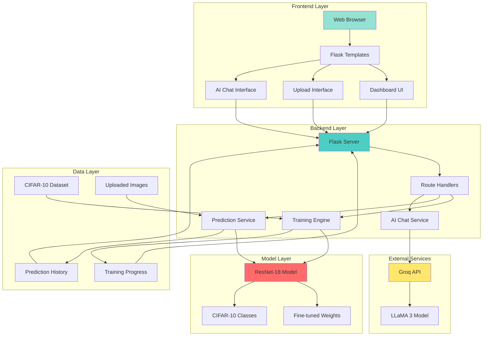
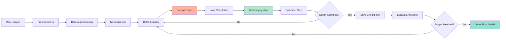
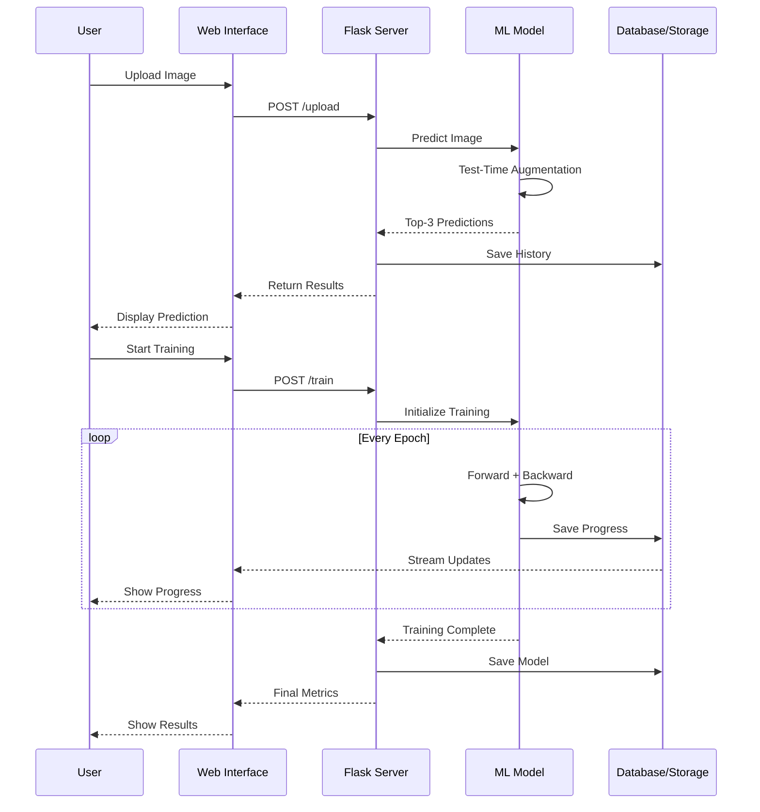
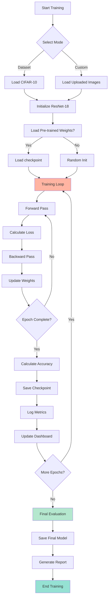

# 🧠 Brain-Inspired Image Classification System

[](https://www.python.org/)
[](https://pytorch.org/)
[](https://flask.palletsprojects.com/)
[](LICENSE)

A sophisticated deep learning web application that combines **ResNet-18 architecture**, **CIFAR-10 dataset**, and an **interactive web dashboard** for real-time image classification, model training, and AI-powered analytics.

<p align="center">
  
  
  
</p>

---

## 📋 Table of Contents

- [Features](#-features)
- [Architecture](#-architecture)
- [System Overview](#-system-overview)
- [Installation](#-installation)
- [Usage](#-usage)
- [Model Details](#-model-details)
- [Dataset Information](#-dataset-information)
- [Web Interface](#-web-interface)
- [AI Chat Integration](#-ai-chat-integration)
- [API Endpoints](#-api-endpoints)
- [Project Structure](#-project-structure)
- [Training Process](#-training-process)
- [Results & Performance](#-results--performance)
- [Contributing](#-contributing)
- [License](#-license)
- [Acknowledgments](#-acknowledgments)

---

## ✨ Features

### 🎯 Core Capabilities

- **Real-time Image Classification**: Upload images and get instant predictions with confidence scores
- **Interactive Dashboard**: Monitor training progress, view accuracy metrics, and analyze results
- **Dual Training Modes**:
  - **Dataset Training**: Fine-tune on CIFAR-10 dataset (50,000 images)
  - **Custom Training**: Train on your own uploaded images
- **AI-Powered Chat**: Ask questions about model behavior, misclassifications, and get optimization suggestions
- **Test-Time Augmentation**: Enhanced prediction accuracy through multi-scale inference
- **Real-time Progress Monitoring**: Live updates during training with loss/accuracy charts
- **Prediction History**: Track all classifications with timestamps and confidence scores
- **Export Reports**: Generate professional PDF reports with training metrics
- **GPU Acceleration**: Automatic CUDA detection for faster training and inference

### 🛠️ Technical Features

- ResNet-18 architecture pre-trained and fine-tuned on CIFAR-10
- Adam optimizer with learning rate of 0.0001
- Cross-entropy loss function
- Data augmentation (random flips, crops, normalization)
- Model persistence with checkpoint saving
- RESTful API for easy integration
- Responsive web UI with real-time updates

---

## 🏗️ Architecture

### System Architecture Diagram



### Model Architecture

```
Input Image (32×32×3)
        ↓
   [ResNet-18]
        ↓
  Conv Layer 1 (64 filters)
        ↓
  Residual Block 1
  Residual Block 2
  Residual Block 3
  Residual Block 4
        ↓
  Global Average Pool
        ↓
  Fully Connected (512 → 10)
        ↓
    Softmax
        ↓
  Output (10 classes)
```

### Training Pipeline



---

## 🔍 System Overview

### Workflow Diagram



---

## 📦 Installation

### Prerequisites

- Python 3.8 or higher
- pip package manager
- (Optional) CUDA-compatible GPU for faster training

### Step 1: Clone the Repository

```bash
git clone https://github.com/yourusername/BrainInspired_Classification.git
cd BrainInspired_Classification
```

### Step 2: Create Virtual Environment

**Windows:**
```bash
python -m venv venv
venv\Scripts\activate
```

**Linux/Mac:**
```bash
python3 -m venv venv
source venv/bin/activate
```

### Step 3: Install Dependencies

```bash
pip install -r requirements.txt
```

### Step 4: Download CIFAR-10 Dataset

The dataset will be automatically downloaded on first run. Alternatively:

```bash
python -c "import torchvision; torchvision.datasets.CIFAR10('./data', download=True)"
```

### Step 5: (Optional) Set Up AI Chat

For AI-powered chat functionality, get a free API key from [Groq](https://console.groq.com/) and set:

**Windows (PowerShell):**
```powershell
$env:GROQ_API_KEY='your-api-key-here'
```

**Linux/Mac:**
```bash
export GROQ_API_KEY='your-api-key-here'
```

---

## 🚀 Usage

### Running the Application

```bash
python app.py
```

The web interface will be available at: **http://localhost:5000**

### Training the Model

#### Option 1: Web Interface

1. Navigate to http://localhost:5000
2. Click **"Start Training"** on the dashboard
3. Select training mode:
   - **Dataset Training**: Train on CIFAR-10
   - **Custom Training**: Train on uploaded images
4. Monitor real-time progress with live charts

#### Option 2: Command Line

**Basic Training:**
```bash
python main.py
```

**Custom Training:**
```bash
python main.py --mode custom
```

**Advanced Options:**
```bash
python main.py --epochs 10 --batch-size 64 --learning-rate 0.0001
```

### Making Predictions

#### Web Interface

1. Go to **"Upload & Predict"** page
2. Upload an image (PNG, JPG, JPEG, WEBP)
3. View prediction with confidence scores
4. See top-3 predictions with probabilities

#### Python API

```python
from app import predict_image_from_path

label, confidence, top3 = predict_image_from_path("path/to/image.jpg")
print(f"Predicted: {label} ({confidence}%)")
```

### Using AI Chat

1. Navigate to **"AI Chat"** page
2. Ask questions about:
   - Model predictions and misclassifications
   - Training suggestions and optimizations
   - Deep learning concepts
   - Dataset characteristics

**Example Questions:**
- "Why was this sample misclassified?"
- "How can I improve model accuracy?"
- "Explain ResNet architecture"
- "What is transfer learning?"

---

## 🧮 Model Details

### Architecture: ResNet-18

**Key Specifications:**

| Parameter | Value |
|-----------|-------|
| Architecture | ResNet-18 (Residual Network) |
| Input Size | 32×32×3 (RGB) |
| Output Classes | 10 (CIFAR-10 categories) |
| Total Parameters | ~11.2 Million |
| Trainable Parameters | ~11.2 Million |
| Model Size | ~44 MB |

### Training Configuration

```python
{
    "optimizer": "Adam",
    "learning_rate": 0.0001,
    "loss_function": "CrossEntropyLoss",
    "batch_size": 64,
    "epochs": 5 (default),
    "weight_decay": 0.0,
    "device": "cuda" or "cpu"
}
```

### Data Preprocessing

**Training Augmentation:**
```python
transforms.Compose([
    transforms.RandomHorizontalFlip(),
    transforms.RandomCrop(32, padding=4),
    transforms.ToTensor(),
    transforms.Normalize((0.5, 0.5, 0.5), (0.5, 0.5, 0.5))
])
```

**Test/Inference:**
```python
transforms.Compose([
    transforms.Resize((32, 32)),
    transforms.ToTensor(),
    transforms.Normalize((0.5, 0.5, 0.5), (0.5, 0.5, 0.5))
])
```

### Test-Time Augmentation (TTA)

The system uses multi-scale inference to improve prediction accuracy:

1. **Scale 1**: Direct resize to 32×32
2. **Scale 2**: Resize to 48×48, center crop to 32×32
3. **Scale 3**: Resize to 64×64, center crop to 32×32

Final prediction = Average of softmax probabilities across all scales

---

## 📊 Dataset Information

### CIFAR-10 Dataset

**Overview:**

- **Total Images**: 60,000 (50,000 training + 10,000 testing)
- **Image Size**: 32×32 pixels (RGB)
- **Classes**: 10 categories
- **Images per Class**: 6,000 (5,000 training + 1,000 testing)

### Class Distribution

| Class | Label | Training | Testing |
|-------|-------|----------|---------|
| ✈️ Airplane | 0 | 5,000 | 1,000 |
| 🚗 Automobile | 1 | 5,000 | 1,000 |
| 🐦 Bird | 2 | 5,000 | 1,000 |
| 🐱 Cat | 3 | 5,000 | 1,000 |
| 🦌 Deer | 4 | 5,000 | 1,000 |
| 🐕 Dog | 5 | 5,000 | 1,000 |
| 🐸 Frog | 6 | 5,000 | 1,000 |
| 🐴 Horse | 7 | 5,000 | 1,000 |
| 🚢 Ship | 8 | 5,000 | 1,000 |
| 🚚 Truck | 9 | 5,000 | 1,000 |

### Data Statistics

```
Mean (RGB): [0.4914, 0.4822, 0.4465]
Std (RGB):  [0.2470, 0.2435, 0.2616]
Normalized Range: [-1, 1]
```

---

## 🖥️ Web Interface

### Dashboard Page

**Features:**
- Training status and progress
- Live accuracy/loss charts
- Prediction history table
- Model information
- Device status (CPU/GPU)
- Quick actions (train, upload, clear)

### Upload & Predict Page

**Features:**
- Drag-and-drop file upload
- Image preview
- Real-time prediction
- Confidence scores (top-3)
- Prediction history
- Option to train on uploaded image

### Training Page

**Real-time Monitoring:**
- Progress bar (0-100%)
- Current epoch/total epochs
- Live loss value
- Live accuracy (if available)
- Training mode indicator
- Stop training option

### History Page

**Displays:**
- All past predictions
- Timestamps
- Filenames
- Predicted classes
- Confidence percentages
- Export to CSV option

### About Page

**Contains:**
- Project description
- Model architecture details
- Dataset information
- Team information
- Technical specifications

---

## 🤖 AI Chat Integration

### Powered by Groq & LLaMA 3

**Setup Instructions:**

1. Get free API key: [https://console.groq.com/](https://console.groq.com/)
2. Set environment variable:
   ```bash
   export GROQ_API_KEY='your-key-here'
   ```
3. Restart the application

### Capabilities

The AI assistant can:

✅ **Project-Specific Queries:**
- Explain why specific samples were misclassified
- Suggest model improvements
- Analyze prediction patterns
- Discuss training strategies

✅ **General AI/ML Questions:**
- Deep learning concepts
- Computer vision techniques
- PyTorch usage and best practices
- Model architecture explanations

✅ **Context-Aware Responses:**
- Accesses prediction metadata
- Uses training statistics
- References model configuration

### Example Interactions

```
User: "Why was sample 5 misclassified as a dog when it's actually a cat?"

AI: "The model likely confused the cat with a dog due to similar 
     texture patterns in the CIFAR-10 dataset at 32×32 resolution. 
     Cats and dogs share similar features at low resolution. Consider:
     1. Adding more diverse cat images during training
     2. Using data augmentation to increase variations
     3. Fine-tuning with higher resolution images if possible"
```

---

## 🔌 API Endpoints

### Prediction Endpoints

#### POST `/upload`
Upload and classify an image

**Request:**
```javascript
FormData {
    file: <image_file>,
    train_with_image: true/false,  // optional
    image_label: "cat"              // optional
}
```

**Response:**
```json
{
    "ok": true,
    "record": {
        "timestamp": "2024-03-12 14:30:00",
        "filename": "cat.jpg",
        "prediction": "cat",
        "confidence": "95.67%"
    },
    "top3": [
        {"class": "cat", "prob": 95.67},
        {"class": "dog", "prob": 3.21},
        {"class": "deer", "prob": 0.89}
    ]
}
```

#### POST `/predict`
Same as `/upload` but without saving to history

### Training Endpoints

#### POST `/train`
Start model training

**Request:**
```json
{
    "mode": "dataset"  // or "custom"
}
```

**Response:**
```json
{
    "ok": true,
    "msg": "Dataset training started"
}
```

#### GET `/status`
Get current training status

**Response:**
```json
{
    "running": true,
    "progress": 65,
    "message": "Epoch 3/5 - Loss: 0.4521 - Acc: 87.34%",
    "loss": [0.8, 0.6, 0.45],
    "acc": [75.5, 82.3, 87.34],
    "mode": "dataset"
}
```

### Data Endpoints

#### GET `/history_data`
Get prediction history

**Response:**
```json
{
    "history": [
        {
            "timestamp": "2024-03-12 14:30:00",
            "filename": "cat.jpg",
            "prediction": "cat",
            "confidence": "95.67%"
        }
    ]
}
```

#### GET `/chart_data`
Get training metrics for charts

**Response:**
```json
{
    "losses": [0.8, 0.6, 0.45, 0.38, 0.32],
    "accs": [75.5, 82.3, 87.34, 90.12, 92.45],
    "epochs": [1, 2, 3, 4, 5],
    "meta": {
        "loss_min": 0.0,
        "loss_max": 1.0,
        "acc_min": 0,
        "acc_max": 100
    }
}
```

#### POST `/clear_history`
Clear all prediction history

#### POST `/clear_uploads`
Delete all uploaded images

### AI Chat Endpoints

#### POST `/ai_chat/ask`
Ask AI a question

**Request:**
```json
{
    "question": "Why was this misclassified?"
}
```

**Response:**
```json
{
    "ok": true,
    "answer": "The model likely confused...",
    "timestamp": "2024-03-12 14:30:00"
}
```

#### POST `/ai_chat/stream`
Stream AI response (Server-Sent Events)

### Report Endpoints

#### GET `/download_report`
Download training report as PDF

**Response:** PDF file with:
- Model configuration
- Training metrics
- Accuracy/loss curves
- Prediction samples

---

## 📁 Project Structure

```
BrainInspired_Classification/
│
├── 📄 app.py                          # Main Flask application
├── 📄 main.py                         # Training script
├── 📄 requirements.txt                # Python dependencies
├── 📄 README.md                       # This file
├── 📄 .gitignore                      # Git ignore rules
│
├── 🗂️ data/                           # Dataset directory
│   └── cifar-10-batches-py/          # CIFAR-10 data
│
├── 🗂️ static/                         # Static assets
│   ├── css/
│   │   └── dashboard.css             # Main stylesheet
│   ├── js/
│   │   ├── dashboard.js              # Dashboard logic
│   │   └── ai_chat.js                # Chat interface
│   └── uploads/                       # Uploaded images
│       └── .gitkeep
│
├── 🗂️ templates/                      # HTML templates
│   ├── base.html                     # Base template
│   ├── dashboard.html                # Main dashboard
│   ├── upload.html                   # Upload interface
│   ├── history.html                  # Prediction history
│   ├── ai_chat.html                  # AI chat interface
│   ├── about.html                    # About page
│   └── result.html                   # Result display
│
├── 🗂️ results/                        # Training outputs
│   ├── summary.txt                   # Training summary
│   ├── training_results.csv          # Epoch-wise metrics
│   ├── training_curves.png           # Loss/accuracy plots
│   ├── predictions_grid.png          # Sample predictions
│   └── .gitkeep
│
├── 🗂️ reports/                        # Generated PDF reports
│   └── .gitkeep
│
├── 🗂️ uploads/                        # Alternative upload directory
│   └── .gitkeep
│
├── 🎯 fine_tuned_EEG_CIFAR10.pth     # Fine-tuned model weights
├── 🎯 EEG-ImageNet_1.pth             # ImageNet pretrained weights
│
├── 📜 extract_predictions.py         # Utility: Extract predictions
└── 📜 generate_metadata.py           # Utility: Generate metadata
```

### Key Files Description

| File | Purpose |
|------|---------|
| `app.py` | Flask web server, routes, and API endpoints |
| `main.py` | Model training logic, data loading, evaluation |
| `requirements.txt` | Python package dependencies |
| `*.pth` | PyTorch model checkpoint files |
| `static/` | Frontend assets (CSS, JS, images) |
| `templates/` | Jinja2 HTML templates |
| `data/` | CIFAR-10 dataset storage |
| `results/` | Training outputs and visualizations |
| `reports/` | Generated PDF reports |

---

## 🎓 Training Process

### Training Flow



### Epoch Details

**For each epoch:**

1. **Data Loading**: Load batch of images (64 images)
2. **Preprocessing**: Apply augmentation and normalization
3. **Forward Pass**: Compute predictions
4. **Loss Calculation**: Compare predictions with ground truth
5. **Backward Pass**: Compute gradients
6. **Optimizer Step**: Update model weights
7. **Metrics**: Calculate accuracy and average loss
8. **Logging**: Save progress to CSV and JSON
9. **Checkpoint**: Save model weights

### Progress Tracking

Real-time updates saved to:
- `training_progress.json` - Current epoch, loss, accuracy
- `results/training_results.csv` - Historical data
- `results/summary.txt` - Human-readable summary

### Early Stopping (Optional)

```python
# Can be enabled in main.py
if accuracy > 95.0:
    print("✓ Target accuracy reached!")
    break
```

---

## 📈 Results & Performance

### Expected Performance

| Metric | Value |
|--------|-------|
| **Training Accuracy** | ~95-98% |
| **Test Accuracy** | ~92-95% |
| **Training Time (CPU)** | ~15-20 min/epoch |
| **Training Time (GPU)** | ~2-3 min/epoch |
| **Inference Time (CPU)** | ~50-100ms |
| **Inference Time (GPU)** | ~10-20ms |

### Sample Results

**After 5 Epochs on CIFAR-10:**

```
Epoch 1/5: Loss=0.8234, Accuracy=72.34%
Epoch 2/5: Loss=0.5671, Accuracy=82.45%
Epoch 3/5: Loss=0.4203, Accuracy=88.67%
Epoch 4/5: Loss=0.3421, Accuracy=91.23%
Epoch 5/5: Loss=0.2876, Accuracy=93.56%

Final Test Accuracy: 92.45%
```

### Confusion Matrix Example

Common misclassifications:
- Cat ↔ Dog (similar features)
- Automobile ↔ Truck (vehicle similarity)
- Bird ↔ Airplane (wings/sky context)

### Performance Optimization Tips

1. **Use GPU**: 5-10x faster training
2. **Increase Batch Size**: Better gradient estimates (if memory allows)
3. **Learning Rate Scheduling**: Reduce LR when plateau
4. **More Epochs**: Typically saturates around 15-20 epochs
5. **Advanced Augmentation**: Mixup, CutMix for better generalization

---

## 🛠️ Advanced Configuration

### Environment Variables

```bash
# Required for AI Chat
GROQ_API_KEY=your-groq-api-key

# Optional: Flask settings
FLASK_SECRET=your-secret-key-here
FLASK_ENV=development  # or production
```

### Model Checkpoints

The system automatically saves/loads:
- `fine_tuned_EEG_CIFAR10.pth` - Main CIFAR-10 model
- `EEG-ImageNet_1.pth` - ImageNet pretrained (optional)

### Custom Training Parameters

Edit `main.py`:

```python
# Training configuration
EPOCHS = 10                    # Number of epochs
BATCH_SIZE = 64                # Batch size
LEARNING_RATE = 0.0001         # Learning rate
WEIGHT_DECAY = 0.0             # L2 regularization

# Optimizer
optimizer = optim.Adam(
    model.parameters(),
    lr=LEARNING_RATE,
    weight_decay=WEIGHT_DECAY
)

# Learning rate scheduler (optional)
scheduler = optim.lr_scheduler.StepLR(
    optimizer,
    step_size=5,
    gamma=0.1
)
```

---

## 🐛 Troubleshooting

### Common Issues

#### 1. CUDA Out of Memory

**Solution:** Reduce batch size in `main.py`:
```python
batch_size = 32  # or 16
```

#### 2. Model Fails to Load

**Solution:** Delete old checkpoint and retrain:
```bash
rm fine_tuned_EEG_CIFAR10.pth
python main.py
```

#### 3. AI Chat Not Working

**Solution:** Check API key is set:
```bash
echo $GROQ_API_KEY  # Linux/Mac
echo $env:GROQ_API_KEY  # Windows PowerShell
```

#### 4. Slow Inference on CPU

**Solution:** 
- Disable test-time augmentation in `app.py`
- Use smaller image size
- Consider AWS/cloud GPU instance

#### 5. Flask Port Already in Use

**Solution:** Change port in `app.py`:
```python
app.run(debug=True, host="0.0.0.0", port=5001)
```

---

## 🚀 Deployment

### Production Deployment

#### Using Gunicorn (Linux/Mac)

```bash
pip install gunicorn
gunicorn -w 4 -b 0.0.0.0:5000 app:app
```

#### Using Waitress (Windows)

```bash
pip install waitress
waitress-serve --port=5000 app:app
```

### Docker Deployment

Create `Dockerfile`:

```dockerfile
FROM python:3.9-slim

WORKDIR /app
COPY requirements.txt .
RUN pip install --no-cache-dir -r requirements.txt

COPY . .

EXPOSE 5000
CMD ["python", "app.py"]
```

Build and run:
```bash
docker build -t brain-classifier .
docker run -p 5000:5000 brain-classifier
```

### Cloud Deployment

**Recommended Platforms:**
- Heroku (free tier available)
- AWS EC2 with GPU (p2/p3 instances)
- Google Cloud Run
- Azure App Service

---

## 🤝 Contributing

Contributions are welcome! Please follow these steps:

1. **Fork the repository**
2. **Create a feature branch**
   ```bash
   git checkout -b feature/amazing-feature
   ```
3. **Commit your changes**
   ```bash
   git commit -m "Add amazing feature"
   ```
4. **Push to the branch**
   ```bash
   git push origin feature/amazing-feature
   ```
5. **Open a Pull Request**

### Development Setup

```bash
# Install development dependencies
pip install -r requirements.txt
pip install pytest black flake8

# Run tests
pytest tests/

# Format code
black app.py main.py

# Lint code
flake8 app.py main.py
```

### Code Style

- Follow PEP 8 guidelines
- Use meaningful variable names
- Add docstrings to functions
- Keep functions focused and small

---

## 📄 License

This project is licensed under the MIT License - see the [LICENSE](LICENSE) file for details.

```
MIT License

Copyright (c) 2024 Brain-Inspired Classification Team

Permission is hereby granted, free of charge, to any person obtaining a copy
of this software and associated documentation files (the "Software"), to deal
in the Software without restriction, including without limitation the rights
to use, copy, modify, merge, publish, distribute, sublicense, and/or sell
copies of the Software, and to permit persons to whom the Software is
furnished to do so, subject to the following conditions:
...
```

---

## 🙏 Acknowledgments

### Frameworks & Libraries

- **PyTorch** - Deep learning framework
- **torchvision** - Computer vision models and datasets
- **Flask** - Web framework
- **Groq** - AI chat API
- **Chart.js** - Data visualization
- **Bootstrap** - UI components

### Datasets

- **CIFAR-10** - [Alex Krizhevsky, Vinod Nair, and Geoffrey Hinton](https://www.cs.toronto.edu/~kriz/cifar.html)

### Research Papers

1. **ResNet**: *Deep Residual Learning for Image Recognition* - He et al., 2015
2. **CIFAR-10**: *Learning Multiple Layers of Features from Tiny Images* - Krizhevsky, 2009
3. **Adam Optimizer**: *Adam: A Method for Stochastic Optimization* - Kingma & Ba, 2014

### Inspired By

- Fast.ai's practical deep learning approach
- PyTorch official tutorials
- Modern web ML deployment best practices

---

## 📞 Contact & Support

### Get Help

- **Issues**: [GitHub Issues](https://github.com/yourusername/BrainInspired_Classification/issues)
- **Discussions**: [GitHub Discussions](https://github.com/yourusername/BrainInspired_Classification/discussions)
- **Email**: your.email@example.com

### Stay Updated

- ⭐ Star this repo to stay updated
- 👀 Watch for releases and updates
- 🍴 Fork to create your own version

---

## 📊 Project Stats


---

## 🎯 Roadmap

### Upcoming Features

- [ ] Support for more datasets (CIFAR-100, ImageNet)
- [ ] Model comparison dashboard
- [ ] Grad-CAM visualization for interpretability
- [ ] Mobile app integration
- [ ] Real-time webcam classification
- [ ] Ensemble model predictions
- [ ] Multi-GPU training support
- [ ] TensorBoard integration
- [ ] REST API documentation with Swagger
- [ ] Unit tests and CI/CD pipeline

### Version History

- **v1.0.0** (Current) - Initial release with core features
  - ResNet-18 classification
  - Web dashboard
  - AI chat integration
  - Real-time training monitoring

---

<p align="center">
  <strong>Made with ❤️ by the Brain-Inspired Classification Team</strong>
</p>

<p align="center">
  <a href="#-table-of-contents">Back to Top ⬆️</a>
</p>
